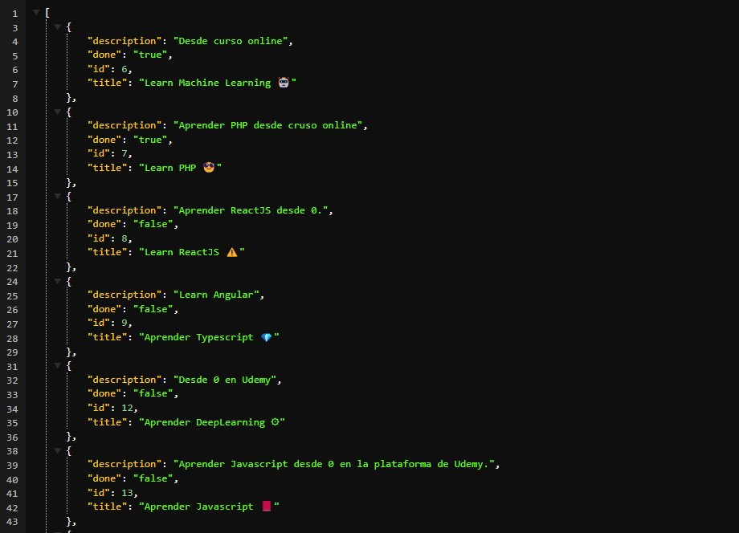

# API REST with Flask, SQLAlchemy and SQLite 

## Table of Content

- [About The Project](#about-the-project)
  - [Description](#description)
  - [Built With](#built-with)
- [Installation](#installation)
- [Usage](#usage)
- [API Reference](#api-reference)
- [Contact](#contact)

## About The Project



## Description

This basic project is a Rest API developed with the Python Flask framework, which also uses an SQLite database that stores tasks and uses the SQLAlchemy ORM.

## Built With

[](https://flask.palletsprojects.com)

[](https://www.sqlite.org)

<a href='https://www.sqlalchemy.org'>
  
</a>

## Installation

1. Clone the repo and change "my-project" to your project name.

```sh
  git clone https://github.com/josemiguel02/my-api-rest-flask.git ./my-project
```

2. Go to the project directory

```sh
  cd my-project
```

3. Install dependencies

```sh
  pip install -r requirements.txt
```

## Usage

Start the server

```sh
  python app.py
```

Running on: http://localhost:5000

# API Reference

### Get all tasks

```http
  GET /todos
```

### Create task

```http
  POST /create
```

### Get single task

```http
  GET /todo/<id>
```

| Parameter | Type     | Description              |
| :-------- | :------- | :----------------------- |
| `id`      | `string` | **Required**. ID of task |

### Edit task

```http
  PUT /edit/<id>
```

| Parameter | Type     | Description              |
| :-------- | :------- | :----------------------- |
| `id`      | `string` | **Required**. ID of task |

### Delete task

```http
  DELETE /delete/<id>
```

| Parameter | Type     | Description              |
| :-------- | :------- | :----------------------- |
| `id`      | `string` | **Required**. ID of task |

## Contact

- Gmail - [josemidev24@gmail.com](mailto:josemidev24@gmail.com)
- Instagram - [@jmdp.02](https://www.instagram.com/jmdp.02)
